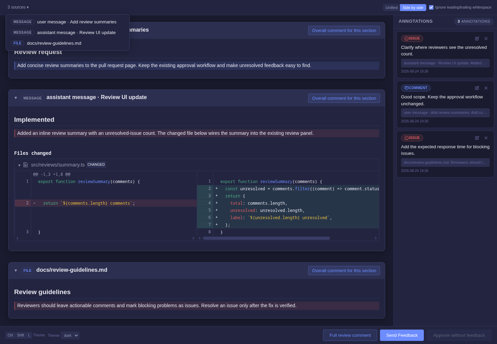

# pi-annotate

A visual annotation extension for pi-agent that opens an interactive annotation UI in your browser for reviewing context messages and markdown documents.

<p align="center">
  
  <br>
  <em>Annotation UI: select text to reveal a floating toolbar, annotations appear in the right panel</em>
</p>

## Installation

```bash
pi install npm:@jackice/pi-annotate
```

Or install from a local path:

```bash
pi install /path/to/pi-annotate
```

Restart pi or run `/reload` to load the extension.

**Requirements:**
- pi-agent v0.35.0 or later (extensions API)

## Features

- **Message Annotation**: Mark one or more previous user or assistant messages from the session tree, collapse message sections as needed, or annotate the last assistant message directly
- **Document Annotation**: Open one or more markdown files (specs, plans, design docs) in one ordered visual review
- **Turn File Diffs**: Annotating an assistant response includes unified or side-by-side diffs for files changed with `edit` or `write` in that response's turn
- **Annotation Types**: Comment, Suggestion, Issue, and Praise — each with distinct color coding
- **Quick Labels**: One-click preset labels for common feedback (needs clarification, missing details, verify assumption, etc.)
- **Floating Toolbar**: Select text to reveal Comment, Suggestion, Issue, Delete, Quick Label, and Looks Good actions
- **Text Feedback Popups**: Comment, Suggestion, and Issue each open a focused text-entry popup
- **Three Comment Scopes**: Annotate selected text, add an overall comment for one source section, or add a full-review comment
- **Feedback Delivery**: Annotations are sent back to the agent as a structured follow-up message
- **Approve Without Feedback**: When no annotations exist, approve documents directly
- **Themes**: Select built-in or installed browser palettes; `⌘+Shift+L` cycles them (`Ctrl` off macOS)
- **Submit Confirmation**: Shows confirmation after submitting feedback or approving

## How It Works

```
┌─────────┐     ┌──────────────────────────────────────┐     ┌─────────┐
│  User   │     │        Browser Annotation UI         │     │  Agent  │
│ runs a  ├────►│                                      ├────►│receives │
│ command │     │  select text → add annotation → send │     │feedback │
└─────────┘     │                                      │     └─────────┘
                └──────────────────────────────────────┘
```

**Lifecycle:**
1. Run `/annotate`, `/annotate <file> [file...]`, or `/annotate-last`
2. Local server starts → annotation UI opens in the system browser
3. Select text in the document → floating toolbar appears with annotation actions
4. Add overall comments from the bottom action bar, or select text for Comment, Suggestion, Issue, Quick Label, Delete, or Praise
5. Session ends via:
   - **Send Feedback** → annotations sent back to agent as follow-up message
   - **Approve without feedback** → document approved, no feedback sent (available when no annotations exist)
   - **Close tab** → session ends without feedback
6. In the TUI, Return is blocked while review is open, preserving the editor draft and blocking both prompts and slash commands. Finish, approve, or close the review before sending another prompt.
7. After sending feedback or approving, the browser may keep the tab open.

## Usage

The extension provides two slash commands:

### `/annotate-last`

Annotate the last assistant message in the current session:

```
/annotate-last
```

Select text in the message, add annotations or quick labels, and send feedback to the agent. If the response changed files with `edit` or `write`, a **Files changed** section lets you switch between unified and side-by-side Git-independent diffs. The whitespace toggle ignores leading/trailing whitespace when computing hunks.

### `/annotate [file]`

Without a file, select any previous user or assistant message from the session tree:

```
/annotate
```

With files, annotate one or more documents in argument order. Quotes and escapes preserve paths with spaces:

```
/annotate docs/superpowers/specs/my-design.md
/annotate "docs/my plan.md" README.md
/annotate @PLAN.md @README.md
```

Every path is resolved and read before the browser opens; a missing or unreadable path opens no partial review. Duplicate resolved paths are shown once, at their first position.

File paths support:
- Relative paths (from current working directory)
- Absolute paths
- `@` prefix notation on each path (e.g., `@docs/superpowers/specs/...`)
- Single quotes, double quotes, and backslash escapes

Turn diffs cover the built-in `edit` and `write` tools. Shell commands and custom tools are not tracked because their filesystem effects cannot be attributed reliably without workspace snapshots.

## Annotation UI

### Floating Toolbar

Select any text to reveal a floating toolbar:

| Button | Action | Description |
|--------|--------|-------------|
| 💬 Comment | Opens text input | Type detailed feedback about the selected text |
| 💡 Suggestion | Opens text input | Propose an improvement for the selected text |
| ⓘ Issue | Opens text input | Describe a problem in the selected text |
| 🗑️ Delete | Creates issue annotation | Suggests removing the selected section |
| ⚡ Quick Label | Opens preset picker | One-click labels for common feedback |
| 👍 Looks Good | Creates praise annotation | Marks the selected text as good |

### Quick Labels

Preset labels for common feedback on specs, plans, and messages:

| Key | Label | Description |
|-----|-------|-------------|
| 1 | ❓ Needs Clarification | The selected section requires further explanation |
| 2 | 📋 Missing Details | Key details or specifics are absent |
| 3 | 🔍 Verify Assumption | Underlying assumption needs to be validated |
| 4 | 🔬 Missing Example | A concrete example would improve understanding |
| 5 | ⚖️ Trade-off Analysis | Pros and cons of this approach should be discussed |
| 6 | 🏗️ Over-engineered | The proposed solution is more complex than needed |
| 7 | 🚫 Out of Scope | This item falls outside the defined scope |
| 8 | ⚠️ Edge Case Missing | Potential edge cases have not been addressed |
| 9 | 📐 Well-structured | The structure and organization are clear |
| 0 | 👍 Good Approach | The proposed approach is sound |

### Annotation Panel

All annotations appear in the right sidebar panel with their source title. Message sections are visually grouped as cards and can collapse their content and diffs without hiding their section comment action. Each source section has **Overall comment for this section**; use **Full review comment** in the bottom action bar for feedback that applies across all sources. For a one-source review, only **Overall comment** is shown. Each annotation shows:
- Type badge with color coding (Comment/Suggestion/Issue/Praise)
- Annotation text
- Original selected text preview, or its section/full-review scope
- Timestamp
- Edit (✏️) and Delete (🗑️) buttons

## Keyboard Shortcuts

| Key | Action |
|-----|--------|
| `⌘+Shift+L` | Cycle installed browser themes (`Ctrl` off macOS) |
| `1`-`9`, `0` | Select Quick Label by number (when picker open) |

### Message selector

| Key | Action |
|-----|--------|
| `↑` / `↓` | Move focus |
| `Space` | Mark or unmark the focused message |
| `Enter` | **Open review** for marked messages, or the focused message when none are marked |
| `/` | Search messages |
| `Esc` | Clear active search, or cancel |

Marked messages stay marked while searching. Reviews use the displayed tree order, never mark order.

## Custom Browser Themes

Install JSON palette files in `~/.pi/agent/pi-annotate/themes/` (or `$PI_CODING_AGENT_DIR/pi-annotate/themes/`). They are loaded when an annotation page opens and appear in its **Theme** selector.

```json
{
  "name": "Nord",
  "colors": {
    "bg-primary": "#2e3440",
    "bg-secondary": "#3b4252",
    "text-primary": "#eceff4",
    "accent": "#88c0d0",
    "type-issue": "#bf616a"
  }
}
```

`name` must be unique and cannot be `dark` or `light`. `colors` may override any palette token: `bg-primary`, `bg-secondary`, `bg-tertiary`, `bg-hover`, `text-primary`, `text-secondary`, `text-muted`, `border`, `border-light`, `accent`, `accent-hover`, `success`, `danger`, `warning`, and the `type-{comment,suggestion,issue,praise}` / `-bg` / `-border` tokens. Values accept hex, `rgb()`/`rgba()`, `hsl()`/`hsla()`, or CSS color keywords. Omitted tokens retain the dark palette's values.

## File Structure

```
pi-annotate/
├── index.ts              # Extension entry point and commands
├── feedback-format.ts    # Model-feedback formatter
├── diff/                 # Git-independent per-turn file diff tracking
├── server.ts              # Annotation HTTP server (API routes)
├── theme.ts               # User theme validation and discovery
├── form/
│   └── annotate.html      # Annotation UI (pure HTML/CSS/JS, no build step)
├── package.json
└── README.md
```

## Feedback Format

When you send feedback, the agent receives a structured message like:

```
## Annotation Feedback

The following feedback was provided for docs/superpowers/specs/my-design.md:

- **suggestion**: Consider adding concrete API design details
  > Original text: "Communication uses a RESTful API"

- **issue**: Error handling strategy is missing
  > Original text: "The system will return an error message on failure"

### Full review

- **comment**: The response should start with a short summary.
  > Applies to: Full review

Please address the issues above.
```

The ending is context-aware:
- If there are **issues**: "Please address the issues above."
- If there are **suggestions**: "Please revise according to the suggestions above."
- Otherwise: "Please consider the feedback above."

## Limits

- Max 5MB request body for feedback submission
- Sessions stay open until feedback, approval, exit, or a normal tab close
- TUI prompt and slash-command submission is blocked while review is open
- Single concurrent annotation session
